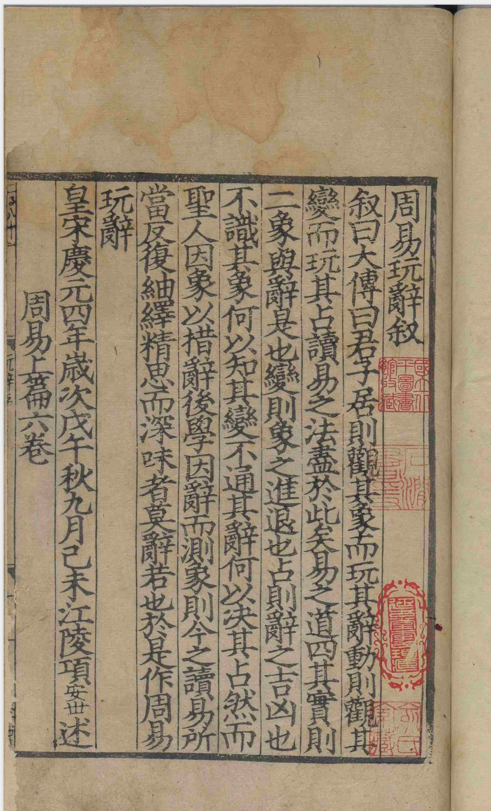
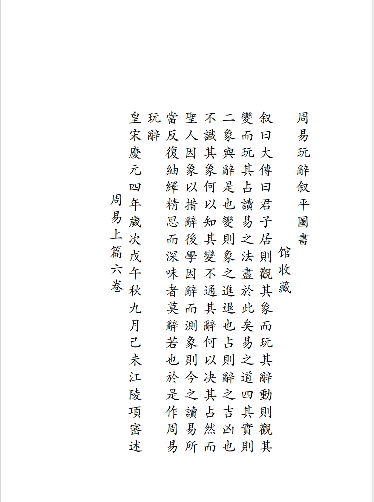

# GenBook — 古籍 PDF / 图片 OCR 转换工具

将**扫描件**（图片版 PDF，或 JPG/PNG 等图片）转换为**可搜索、可复制的文字 PDF**。竖排繁体、简体横排均可。

- 自动识别文字与图片区域，支持百度 / 腾讯 / Google 三大 OCR 云端引擎
- 竖排：保留从右到左版式，输出 Typst 源文件（可在 Tinymist 中实时预览微调）
- 横排：简体横排，默认按 OCR 坐标绝对定位（原图第 n 行对应生成 PDF 第 n 行）
- PDF 入口：`main.py`；图片入口：`img.py`（单文件、多文件或目录）

## 效果展示

《周易玩辞》扫描页 → 可搜索繁体竖排 PDF。

<p align="center">
  
  
</p>
<p align="center"><sub>左：扫描原图　　右：GenBook 竖排输出</sub></p>

---

## 目录

1. [环境要求与安装](#1-环境要求与安装)
2. [配置 API 凭证](#2-配置-api-凭证)
3. [配置字体](#3-配置字体)
4. [运行转换](#4-运行转换)
5. [排版配置](#5-排版配置)
6. [目录结构](#6-目录结构)

---

## 1. 环境要求与安装

| 项目 | 要求 |
|---|---|
| Python | 3.10 或以上 |
| 操作系统 | Windows / macOS / Linux |
| 网络 | 需能访问所选 OCR 云服务 |

```bash
pip install -r requirements.txt
```

---

## 2. 配置 API 凭证

```bash
# Windows
copy .env.example .env
# macOS / Linux
cp .env.example .env
```

用文本编辑器打开 `.env`，填入对应 Key（默认使用百度 OCR）：

```ini
OCR_BACKEND=baidu

BAIDU_OCR_APP_ID=填入你的AppID
BAIDU_OCR_API_KEY=填入你的APIKey
BAIDU_OCR_SECRET_KEY=填入你的SecretKey
```

> ⚠️ `.env` 含私钥，请勿提交到 git 或分享。

---

## 3. 配置字体

将字体文件放入 `fonts/` 目录，并在 `config/layout_config.yaml` 中指定：

```bash
# Windows 系统楷体
copy C:\Windows\Fonts\STKAITI.TTF fonts\STKAITI.TTF
```

```yaml
font_family: "STKaiTi"
font_path:   "fonts/STKAITI.TTF"
```

跨平台可用 [Noto Serif CJK TC](https://fonts.google.com/noto/specimen/Noto+Serif+TC)，下载后放入 `fonts/` 并更新配置。

---

## 4. 运行转换

每次运行在 `output/` 同时生成三个文件：

| 文件 | 说明 |
|---|---|
| `书名_out_时间戳.pdf` | 最终 PDF（Typst 编译） |
| `书名_out_时间戳.typ` | Typst 排版源文件（可用 Tinymist 预览/微调） |
| `书名_out_时间戳.ocr.json` | OCR 缓存（可跳过 OCR 重新排版） |

### 快速开始

```bash
# 完整流程：OCR → 流式 typ → PDF（推荐加 --paddle-vl）
python main.py input/古籍.pdf --pages 1-20 --paddle-vl

# 使用绝对坐标模式
python main.py input/古籍.pdf --pages 1-20 --no-flow --paddle-vl
```

### 四种运行模式

| 模式 | 命令 |
|---|---|
| A 完整流程 | `python main.py input/古籍.pdf --pages 1-20 --paddle-vl` |
| B 从缓存重新生成 typ + PDF | `python main.py --from-cache output/xxx.ocr.json` |
| C 从缓存只生成 typ | `python main.py --from-cache output/xxx.ocr.json --typ-only` |
| D 从 typ 编译 PDF | `python main.py --pdf-from-typ output/xxx.typ` |

### 排版模式切换

| 参数 | 说明 |
|---|---|
| `--flow`（默认） | 流式 grid 竖排：列顺序即显示顺序，插删列只需增删 grid 子项 |
| `--no-flow` | 绝对坐标竖排：每列用 `#place(dx,dy)` 精确定位 |

```bash
# 模式 B/C 同样支持 --no-flow
python main.py --from-cache output/xxx.ocr.json --typ-only --no-flow
```

### 典型工作流

```
1. 首次运行（模式 A，建议加 --paddle-vl）
   python main.py input/古籍.pdf --pages 1-50 --paddle-vl

2. 调整配置后重排（模式 B，秒级，无需重跑 OCR）
   python main.py --from-cache output/古籍_out_xxx.ocr.json --output 古籍_v2.pdf

3. 在 Tinymist 中微调 .typ 后编译（模式 D，秒级）
   python main.py --pdf-from-typ output/古籍_out_xxx.typ --output 古籍_final.pdf
```

### 完整参数

| 参数 | 说明 |
|---|---|
| `input_pdf` | 源 PDF 路径（模式 A 必填） |
| `--pages` / `-p` | 页码范围，如 `1-20`（默认全部） |
| `--output` / `-o` | 输出文件名（默认：源名\_out\_时间戳） |
| `--dpi` | 渲染分辨率（默认 `300`） |
| `--confidence` | OCR 置信度阈值（默认 `0.7`） |
| `--config` | 排版配置文件（默认 `config/layout_config.yaml`） |
| `--from-cache` | 指定 `.ocr.json` 跳过 OCR |
| `--typ-only` | 与 `--from-cache` 配合，只生成 `.typ` |
| `--pdf-from-typ` | 直接从 `.typ` 编译 PDF |
| `--flow` / `--no-flow` | 流式模式 / 绝对坐标模式 |
| `--paddle-vl` | 百度 OCR 改用文档解析 PaddleOCR-VL。**古籍扫描建议加上**：识别更准，生僻字、异体字更少漏识 |

不加 `--paddle-vl` 时默认走高精度 `accurate()`。效果通常可用，但部分字可能识别不出，排进 PDF 后会显示成空白方框（□）。对照实测，PaddleOCR-VL 对刻本正文更稳。

```bash
python main.py input/古籍.pdf --pages 1-20 --paddle-vl
python img.py input/page.jpg --layout horizontal --config config/layout_config_modern_cn.yaml --paddle-vl
```

也可用环境变量 `BAIDU_OCR_API=paddle-vl`，与命令行 `--paddle-vl` 等效。

### 图片输入（`img.py`）

输入是图片（单文件、多文件或目录），不是 PDF。OCR / 缓存 / Typst 编译与 `main.py` 相同；横排走独立 writer。

支持格式：`.png` `.jpg` `.jpeg` `.tif` `.tiff` `.webp` `.bmp`。目录内按文件名排序，一图一页。

```bash
# 单张图片（排版方向由 --config 的 writing_mode 决定，默认竖排配置）
python img.py input/page.png --paddle-vl

# 目录（多页），只处理第 1–15 张
python img.py input/scans/ --pages 1-15 --paddle-vl

# 多文件
python img.py a.png b.jpg --output 合集.pdf
```

缓存与四种模式（`--from-cache` / `--typ-only` / `--pdf-from-typ`）用法同 `main.py`。

| 参数 | 说明 |
|---|---|
| `inputs` | 图片文件或目录（可多个） |
| `--layout` | `auto`（默认，读配置 `writing_mode`）/ `vertical` / `horizontal` |
| `--dpi` | 仅用于坐标换算的假定 DPI（图片不再缩放，默认 `300`） |
| `--paddle-vl` | 同 `main.py`：改用 PaddleOCR-VL，减少漏识后的方框缺字 |
| 其余 | `--pages` `--output` `--config` `--from-cache` `--typ-only` `--pdf-from-typ` `--flow` `--no-flow` 与 `main.py` 相同 |

### 简体横排

使用大陆横排配置 `config/layout_config_modern_cn.yaml`（大 32 开 140×203 mm，`writing_mode: horizontal-tb`）。

```bash
# 图片 → 横排 PDF（默认 --no-flow：按 OCR JSON 坐标等比定位）
python img.py input/page.jpg --layout horizontal --config config/layout_config_modern_cn.yaml --paddle-vl

# 指定输出名
python img.py "/path/to/123.jpg" --layout horizontal --config config/layout_config_modern_cn.yaml --paddle-vl --output 123.pdf

# 从 OCR 缓存重排（不重新调用云 OCR）
python img.py --from-cache output/123.ocr.json --layout horizontal --config config/layout_config_modern_cn.yaml --output 123.pdf

# 横排段落重排（两端对齐、首行缩进；需显式 --flow）
python img.py input/page.jpg --layout horizontal --config config/layout_config_modern_cn.yaml --flow
```

`--layout auto` 时：CN 配置会走横排，港台竖版配置走竖排。也可对竖版配置强制 `--layout horizontal`。

| 参数 | 竖排（`main.py` / `img.py --layout vertical`） | 横排（`img.py --layout horizontal`） |
|---|---|---|
| `--flow`（默认） | 流式 grid：列顺序即显示顺序 | 需显式指定：段落重排 |
| `--no-flow` | 每列 `#place(dx,dy)` | **默认**：高度相近为同一行，行内左→右；`dx/dy` 由 JSON 坐标相对页宽/页高等比换算 |

---

## 5. 排版配置

用 `--config` 指定配置文件：

| 文件 | 用途 |
|---|---|
| `config/layout_config.yaml` | 扫描还原，竖排（`main.py` 默认） |
| `config/layout_config_modern_tw.yaml` | 港台竖版，JIS-B5 |
| `config/layout_config_modern_tw_large.yaml` | 港台大字竖版 |
| `config/layout_config_modern_cn.yaml` | 大陆简体横排，大 32 开（140×203 mm） |

编辑 `config/layout_config.yaml`：

```yaml
font_family: "STKaiTi"
font_size:   14          # 字号（磅）
line_spacing: 0          # 行距（0=自动，字号×20%）
column_spacing: 4        # 列间距（磅）

guji_layout:
  paper: "jis-b5"        # 纸张规格
  tian_tou_mm:    25     # 天头（上边距 mm）
  di_jiao_mm:     20     # 地脚（下边距 mm）
  zhuang_ding_mm: 20     # 装订侧边距 mm
  shu_kou_mm:     15     # 书口侧边距 mm
  show_page_num:  true
  page_num_style: "chinese"   # chinese | arabic

  styles:
    heading_scale:  1.50   # 大標題 = font_size × 1.50
    title_scale:    1.30   # 篇章標題
    author_scale:   0.80   # 著者
    note_scale:     0.54   # 夾注
```

> 修改配置后用**模式 B** 从缓存重新生成，无需重跑 OCR。

生成的 `.typ` 文件头部有完整的 `#let` 变量声明，也可直接在文件中修改，Tinymist 热更新即时生效。

---

## 6. 目录结构

```
GenBook/
├── main.py                  # PDF 入口（--help 查看所有参数）
├── img.py                   # 图片入口（竖排 / 横排）
├── requirements.txt
├── .env.example             # API 凭证模板
│
├── config/
│   ├── layout_config.yaml              # 扫描还原，竖排
│   ├── layout_config_modern_tw.yaml    # 港台竖版
│   ├── layout_config_modern_tw_large.yaml
│   └── layout_config_modern_cn.yaml    # 大陆简体横排
│
├── fonts/                   # 字体文件（手动放入，不提交 git）
├── docs/                    # README 展示图
├── input/                   # 待转换的源 PDF / 图片
├── output/                  # 转换结果（pdf / typ / ocr.json）
│
├── modules/
│   ├── pdf_reader.py        # PDF → 高清图片
│   ├── image_reader.py      # 图片文件 → 页
│   ├── layout_analyzer.py   # 版面分析
│   ├── ocr_engine.py        # OCR 识别
│   ├── ocr_jpeg.py          # 图片送检压缩（百度体积限制）
│   ├── ocr_cache.py         # OCR 缓存序列化
│   ├── image_cropper.py     # 图片区域裁剪
│   ├── page_model.py        # 中间数据模型
│   ├── typst_flow_writer.py # 流式 grid 竖排生成（默认）
│   ├── typst_writer.py      # 绝对坐标竖排生成（--no-flow）
│   ├── typst_horizontal_writer.py  # 简体横排（img.py）
│   └── pdf_writer.py        # ReportLab PDF（降级备用）
│
└── tests/
    ├── preview_flow_typ.py  # 将绝对坐标 .typ / .ocr.json 转流式 .typ
    └── test_*.py            # 单元测试
```
